<!--
$theme: default
$size: 4:3
page_number: true
footer: « Julia, my new computing friend? » | 14 June 2018, IETR@Vannes | By: L. Besson & P. Haessig
-->

<link rel="stylesheet" type="text/css" href="common/marp-naereen.css" />

# « Julia, my new friend for computing and optimization? »

- **Intro to the Julia programming language, for MATLAB users**

- *Date:* 14th of June 2018

- *Who:* Lilian Besson & Pierre Haessig
   (SCEE & AUT team @ IETR / CentraleSupélec campus Rennes)

<center></center>

---

# Agenda for today [25 min]

1. What is Julia [3 min]
2. Comparison with MATLAB [3 min]
3. Examples of problems solved Julia [5 min]
4. Longer example on optimization with JuMP [10min]
5. Links for more information ?  [2 min]

---

# 1. What is Julia ?

- Developed and popular from the [last 7 years](https://julialang.org/blog/2012/02/why-we-created-julia)
- Open-source and free programming language (MIT license)
- Interpreted *and* compiled, very efficient
- But easy syntax, dynamic typing, inline documentation etc
- Multi-platform, imperative
- MATLAB-like syntax for linear algebra etc
- Designed and acknowledged as *simple to learn and use*
- Easy to run your code in parallel (multi-core & cluster)
- Used worldwide: research, data science, finance etc…

---

# Ressources
- **Website**: [JuliaLang.org](https://julialang.org/) for the language & [Pkg.JuliaLang.org](https://pkg.julialang.org/) for packages
- Documentation : [docs.JuliaLang.org](https://docs.julialang.org/en/latest/)

<center>

---

# Comparison with MATLAB

|  | Julia :smiley: | MATLAB :cry:
|:-|:-:|:-:|
| **Cost** | Free :v: | Hundreds of euros / year
| **License** | Open-source | 1 year user license (no longer after your PhD!)
| **Comes from** | A non-profit foundation, and the community | MathWorks company
| **Scope** | Mainly numeric | Numeric only
| **Performances** | Very good performance | Faster than Python, slower than Julia

---

# Comparison with MATLAB

|  | Julia | MATLAB
|:-|:-:|:-:|
| **Packaging** | `Pkg` manager included. Based on `git` + GitHub, very easy to use | Toolboxes already included but :moneybag: have to pay if you wat more!
| **Editor/IDE** | [*Jupyter*](https://jupyter.org/) is recommended ([*Juno*](http://junolab.org/) is also good) | Good IDE already included
| **Parallel computations** | Very easy, low overhead cost | Possible, high overhead

---

# Comparison with MATLAB

|  | Julia | MATLAB
|:-|:-:|:-:|
| **Usage** | Generic, worldwide :earth_americas: | Research in academia and industry
| **Fame** | Young but starts to be known | Old and known, in decline
| **Support?** | Community$^1$ (StackOverflow, mailing lists etc).  | By MathWorks
| **Documentation** | OK and growing, inline/online | OK, inline/online

> Note$^1$: **JuliaPro** offer paid licenses, if professional support is needed.

---

# How to install Julia :arrow_down: (1/2)
- You can try online *for free* on [JuliaBox.com](https://www.juliabox.com/)

- On Linux, Mac OS or Windows:
  + You can use the default installer :package:
    from the website [julialang.org/downloads](https://julialang.org/downloads/)
- Takes about 4 minutes... and it's free !

> You also need Python 3 to use Jupyter :sparkles:, I suggest to use
> [Anaconda.com/download](https://www.anaconda.com/download/) if you don't have Python yet.

---

# How to install Julia :arrow_down: (2/2)


1. Select the binary of your platform :package:
2. Run the binary :running: !
3. Wait :clock130:…
4. Done :ok_hand: ! Test with `julia` in a terminal

---

# Different tools to use Julia
- Use `julia` for the command line for short experiments
  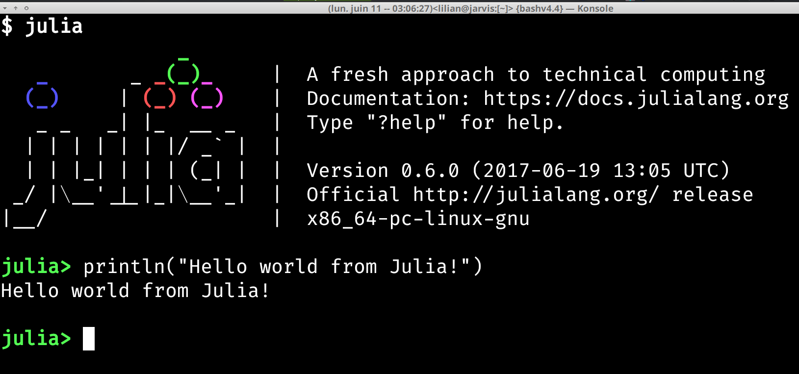
- Use the *Juno* IDE to edit large projects

> Demo time :watch: !

---

# Different tools to use Julia
- Use **Ju***pyter* notebooks to write or share your experiments
  (examples: [`github.com/Naereen/notebooks`](https://github.com/Naereen/notebooks/))
  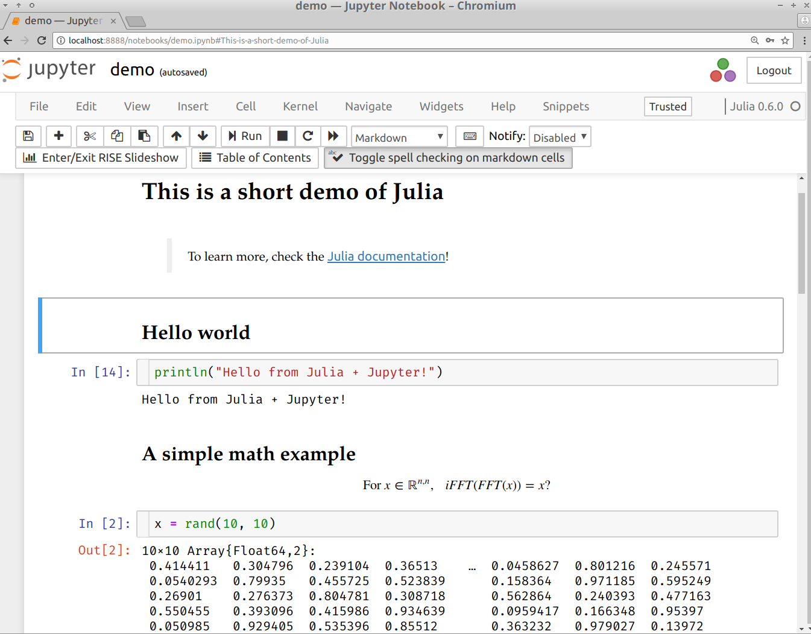

> Demo time :watch: !

---

## :package: How to install modules in Julia ?
- Installing is **easy** !
```julia
julia> Pkd.add("IJulia")  # installs IJulia
```

- Updating also!
```julia
julia> Pkg.update()
```

## :mag: How to find the module you need ?
- First… ask your colleagues :smile: !
- Complete list on [pkg.JuliaLang.org](https://pkg.julialang.org)

---

# :package: Overview of famous Julia modules

- Plotting: 
  - [`Winston.jl`](https://github.com/JuliaGraphics/Winston.jl) for easy plotting like MATLAB
  - [`PyPlot`](https://github.com/JuliaPy/PyPlot.jl): interface to Matplotlib (Python)
- The [JuliaDiffEq](http://juliadiffeq.org) collection for **differential equations**
- The [JuliaOpt](https://www.juliaopt.org/) collection for **optimization**
- The [JuliaStats](http://juliastats.github.io) collection for **statistics**
- And many more!

> Find more specific packages on [GitHub.com/svaksha/Julia.jl/](https://github.com/svaksha/Julia.jl/)

---

# Many packages, and a quickly growing community

[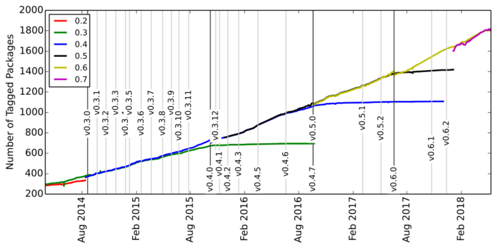](https://pkg.julialang.org/pulse.html)

> Julia is still in development, in version v0.6 but version 1.0 is planned soon!

---

# 2. Main differences in syntax between Julia and MATLAB
> Ref: [cheatsheets.quantecon.org](https://cheatsheets.quantecon.org/)

|  | Julia | MATLAB
|:-|:-:|:-:|
| **File ext.** | `.jl` | `.m`
| **Comment** | `# blabla...` | `% blabla...`
| **Indexing** | `a[1]` to `a[end]` | `a(1)` to `a(end)`
| **Slicing** | `a[1:100]` (view) | `a(1:100)` (:warning: copy)
| **Operations** | Linear algebra by default | Linear algebra by default
| **Block** | Use `end` to close all blocks | Use `endif` `endfor` etc

---

|  | Julia | MATLAB
|:-|:-:|:-:|
| **Help** | `?func` | `help func`
| **And** | `a & b` | `a && b`
| **Or** | `a | b` | `a || b`
| **Datatype** | `Array` of *any* type | multi-dim doubles array
| **Array** | `[1 2; 3 4]` | `[1 2; 3 4]`
| **Size** | `size(a)` | `size(a)`
| **Nb Dim** | `ndims(a)` | `ndims(a)`
| **Last** | `a[end]` | `a(end)`

---

|  | Julia | MATLAB
|:-|:-:|:-:|
| **Tranpose** | `a.'` | `a.'`
| **Conj. transpose** | `a'` | `a'`
| **Matrix** x | `a * b` | `a * b`
| **Element-wise** x | `a .* b` | `a .* b`
| **Element-wise** / | `a ./ b` | `a ./ b`
| **Element-wise** ^ | `a ^ 3` | `a .^ 3`
| **Zeros** | `zeros(2, 3, 5)` | `zeros(2, 3, 5)`
| **Ones** | `ones(2, 3, 5)` | `ones(2, 3, 5)`
| **Identity** | `eye(10)` | `eye(10)`
| **Range** | `range(0, 100, 2)` or `1:2:100` | `1:2:100`

---

|  | Julia | MATLAB
|:-|:-:|:-:|
| **Maximum** | `max(a)` | `max(max(a))` ?
| **Random matrix** | `rand(3, 4)` | `rand(3, 4)`
| L2 **Norm** | `norm(v)` | `norm(v)`
| **Inverse** | `inv(a)` | `inv(a)`
| **Solve syst.** | `a \ b` | `a \ b`
| **Eigen vals** | `V, D = eig(a)` | `[V,D]=eig(a)`
| **FFT/IFFT** | `fft(a)`, `ifft(a)` | `fft(a)`,`ifft(a)`

> Very close to MATLAB for linear algebra!

---

# 3. Scientific problems solved with Julia
> Just to give examples of syntax and modules

1. 1D numerical integration and plot
2. Solving a $2^{\text{nd}}$ order Ordinary Differential Equation

---

# 3.1. 1D numerical integration and plot

> Exercise : evaluate and plot this function on [-1, 1] :
> $$\mathrm{Ei}(x) := \int_{-x}^{\infty} \frac{\mathrm{e}^u}{u} \;\mathrm{d}u$$

## How to?
Use packages and everything is easy!

- [`QuadGK.jl`](https://github.com/JuliaMath/QuadGK.jl) for integration
- [`Winston.jl`](https://github.com/JuliaGraphics/Winston.jl) for 2D plotting

---

```julia
using QuadGK

function Ei(x, minfloat=1e-3, maxfloat=100)
    f = t -> exp(-t) / t  # inline function, with '- >'
    if x > 0
        return quadgk(f, -x, -minfloat)[1]
             + quadgk(f, minfloat, maxfloat)[1]
    else
        return quadgk(f, -x, maxfloat)[1]
    end
end

X = linspace(-1, 1, 1000)   # 1000 points
Y = [ Ei(x) for x in X ]

using Winston
plot(X, Y)
title("The function Ei(x)")
xlabel("x"); ylabel("y")
savefig("figures/Ei_integral.png")
```

---

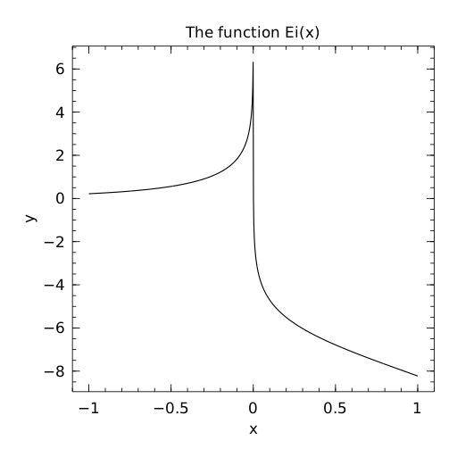

---

# 3.2. Solving a $2^{\text{nd}}$ order ODE

> Goal : solve and plot the differential equation of a pendulum:
> $$\theta''(t) + b \,\theta'(t) + c \,\sin(\theta(t)) = 0$$
> For $b = 1/4$, $c = 5$, $\theta(0) = \pi - 0.1$, $\theta'(0)=0$, $t\in[0,10]$

## How to?
Use packages!

- [`DifferentialEquations.jl`](https://github.com/JuliaDiffEq/DifferentialEquations.jl) function for ODE integration
- [`Winston.jl`](https://github.com/JuliaGraphics/Winston.jl) for 2D plotting

---

```julia
using DifferentialEquations

b, c = 0.25, 5.0

# macro magic!
pend2 = @ode_def Pendulum begin
  dθ = ω  # <-- yes, this is UTF8
  dω = (-b * ω) - (c * sin(θ))
end

prob = ODEProblem(pend, y0, (0.0, 10.0))
sol = solve(prob)         # ↑ solve on interval [0,10]
t, y = sol.t, hcat(sol.u...)'

using Winston
plot(t, y[:, 1], t, y[:, 2])
title("2D Differential Equation")
savefig("figures/Pendulum_solution.png")
```

---

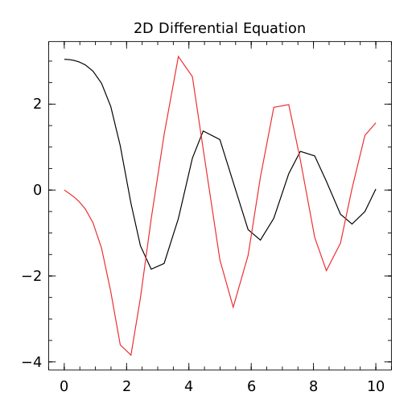

---

# Conclusion (1/2)

## Sum-up
- I hope you got a good introduction to Julia
- It's not hard to migrate from MATLAB to Julia
- Good start:
  [`docs.JuliaLang.org/en/stable/manual/getting-started`](https://docs.julialang.org/en/stable/manual/getting-started/)


---

# Conclusion (2/2)

> *Thanks for joining :clap: !*

## Your mission, if you accept it... :boom:
1. :baby: *Padawan level:* Train yourself a little bit on Julia
   $\hookrightarrow$ [JuliaBox.com](https://www.juliabox.com/) ? Or install it on your laptop!
   And ead [introduction in the Julia manual](https://docs.julialang.org/en/stable/manual/introduction/)!
2. :woman_student: *Jedi level:* Try to solve a numerical system, from your research or teaching, **in Julia instead of MATLAB**
3. :crossed_swords: *Master level:* From now on, try to use open-source & free tools for your research (Julia, Python and others)… :money_mouth_face:


---
<!-- *template: break -->

# Examples


1. **Iterative computation**: signal filtering
2. **Optimization**: robust regression on RADAR data

---

# Iterative computation

The classical saying: 

> *“Vectorized code often runs much faster than the corresponding code containing loops.”* ([MATLAB doc](https://mathworks.com/help/matlab/matlab_prog/vectorization.html))

does not hold for Julia, because of  its **just-in-time compiler**.

Example for the smoothing of a signal $\{u_k\}_{k\in\mathbb{N}}$:

$$ y_k = ay_{k-1} + (1-a) u_k, \;\;\;\; k\in\mathbb{N}^+ $$


Parameter $a$ tunes the smoothing, between none ($a=0$) and strong smoothing ($a\to1^-$).

<!-- NB : Matlab also has JIT https://fr.mathworks.com/products/matlab/matlab-execution-engine.html but it may not work well in all cases -->


---

# Optimization problem

Example problem: Identifying the sea clutter in Weather Radar data.

* is a **robust regression** problem
    * is an optimization problem

<span class="detail">
An “IETR-colored” example, inspired by:

* Radar data: P.-J. Trombe *et al.*, “Weather radars – the new eyes for offshore wind farms?,” *Wind Energy*, 2014.
* Regression methods: S. Boyd and L. Vandenberghe, Convex Optimization. Cambridge University Press, 2004. (Example 6.2)
</span>

---
# Weather radar: the problem of sea clutter


<center>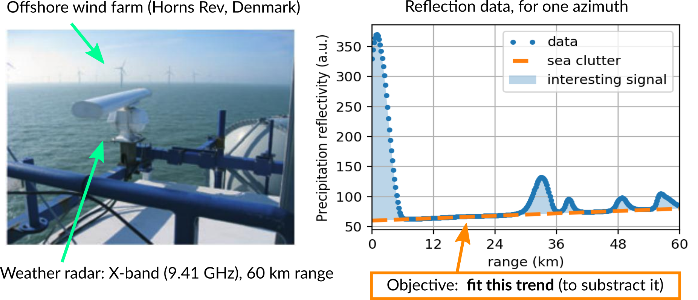
</center>

Given $n$ data points $(x_i, y_i)$, fit a linear trend:

$$\hat{y} = a.x + b$$

An optimization problem with two parameters: $a$ (slope), $b$ (intercept)

---
# Regression as an optimization problem

The parameters for the trend $(a,b)$ should minimize a criterion $J$ which penalizes the residuals $r_i = y_i - \hat{y} = y_i - a.x + b$:

$$ J(a,b) = \sum_i \phi(r_i)$$

where $\phi$ is the *penaly function*, to be chosen:

* $\phi(r) = r^2$: quadratic deviation → least squares regression
* $\phi(r) = \lvert r \rvert$: absolute value deviation
* $\phi(r) = h(r)$: [Huber loss](https://en.wikipedia.org/wiki/Huber_loss)
* ...

---
# Choice of penalty function
The choice of the loss function influences:

* the optimization result (fit quality)
    * e.g. in the presence of outliers
* the properties of optimization problem: convexity, smoothness

### Properties of each function

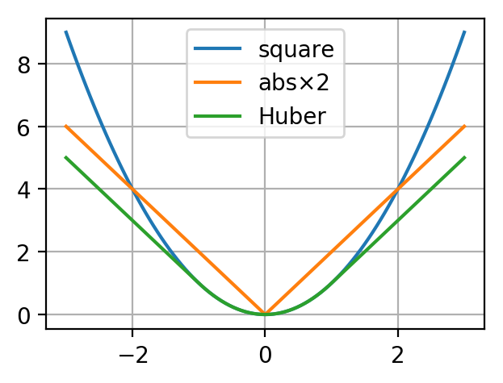

* quadratic: convex, smooth, heavy weight for strong deviations
* absolute value: convex, not smooth
* Huber: a mix of the two

---

# How to solve the regression problem

## Option 1: specific tools

a specific tool for each type of regression:
* “least square toolbox” (→ [MultivariateStats.jl](https://github.com/JuliaStats/MultivariateStats.jl))
* “least absolute value toolbox” (→ [quantile regression](https://github.com/pkofod/QuantileRegression.jl/))
* “Huber toolbox” (i.e. robust regression → ???)
* ...

## Option 2: a generic tool


→ a **Modeling Language for Optimization**

+more freedom to explore variants of the problem

---
<!-- *template: break -->

# Modeling Languages for Optimization

*Purpose: make it easy to **specify** and **solve** optimization problems without expert knowledge*.

---
  
# <span style="font-size:0.8em;">Tasks for solving a practical optimization problem </span>

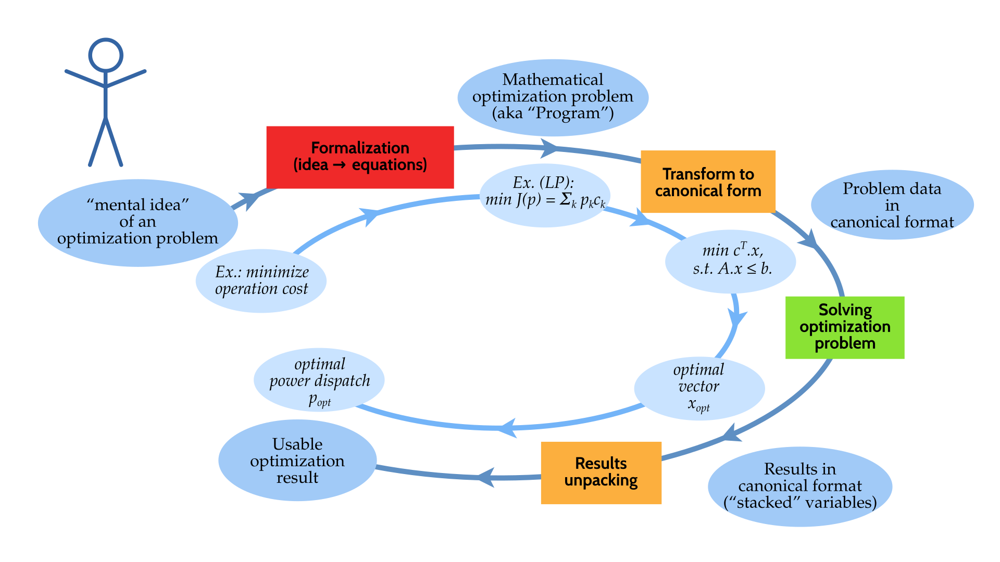

---
  
# <span style="font-size:0.8em;">Tasks for solving a practical optimization problem </span>

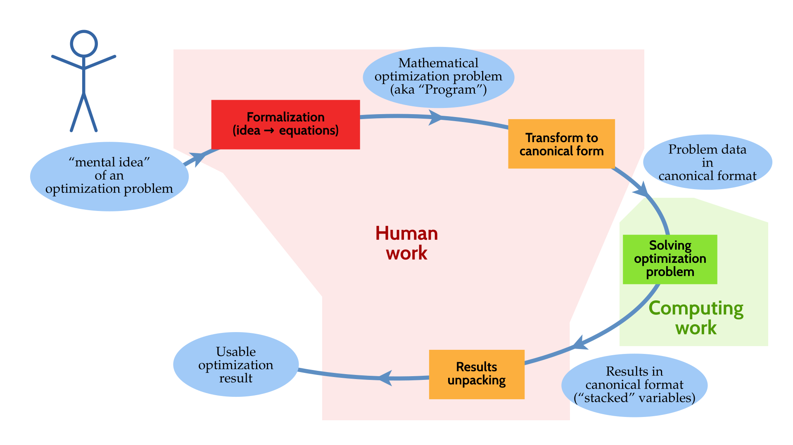

---
  
# <span style="font-size:0.8em;">Tasks for solving a practical optimization problem </span>

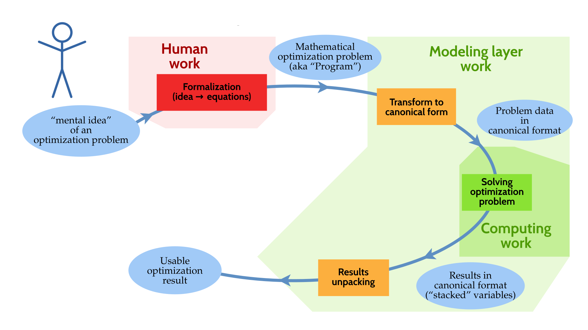


---
# JuMP: optimization modeling in Julia

The [JuMP](https://github.com/JuliaOpt/JuMP.jl) package offers a domain-specific modeling language for mathematical optimization.


JuMP interfaces to many optimization solvers: open-source (Ipopt, GLPK, Clp, ECOS...) and commercial (CPLEX, Gurobi, MOSEK...).

Other Modeling Languages for Optimization:

* Standalone software: AMPL, GAMS
* Matlab: YALMIP ([previous seminar](http://pierreh.eu/efficient-tools-seminar/)), CVX
* Python: Pyomo, PuLP, CVXPy


> Claim: JuMP is **fast**, thanks to Julia's [metaprogramming](https://docs.julialang.org/en/stable/manual/metaprogramming/#Metaprogramming-1) capabilities (generation of Julia code within Julia code).

--- 

# Regression with JuMP

Given `x` and `y` the 300 data points, common part:

```julia
m = Model(solver = ECOSSolver())

@variable(m, a)
@variable(m, b)

res = a*x .- y +b
```

`res` (“residuals”) is an Array of 300 elements of type `JuMP.GenericAffExpr{Float64,JuMP.Variable}`, i.e. a semi-symbolic affine expression.

Now, we need to specify the penalty on those residuals

---

# Regression choice: least squares


$$\min \sum_i r_i^2$$

reformulated as a [Second-Order Cone Program](https://en.wikipedia.org/wiki/Second-order_cone_programming) (SOCP):


$$\min j, \quad \text{such that} \; \lVert r \rVert_2 \leq j$$


```julia
@variable(m, j)
@constraint(m, norm(res) <= j);
@objective(m, Min, j)
```
(SOCP → [ECOS](https://github.com/embotech/ecos) solver)

---

# Regression choice: least absolute deviation

$$\min \sum_i \lvert r_i \rvert $$

reformulated as a [Linear Program](https://en.wikipedia.org/wiki/Linear_programming) (LP)

$$\min \sum_i t_i, \quad \text{such that} \; -t_i \leq r_i \leq t_i$$

```julia
@variable(m, t[1:n] )
@constraint(m, res .<= t)
@constraint(m, res .>= -t)
@objective(m, Min, sum(t));
```

--- 
# Solve! :gear:<


```julia
julia> solve(m)
[solver blabla... ⏳ ]
:Optimal # hopefully
```

```julia
> getvalue(a), getvalue(b)
(-1.094, 127.52) # for least squares
```

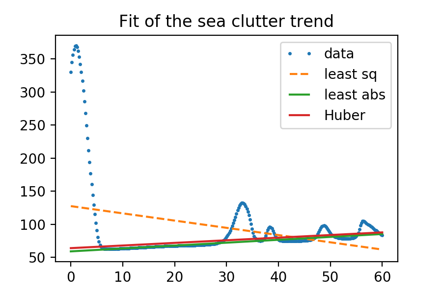